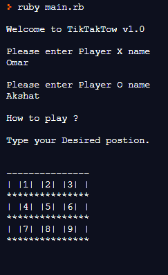

# Tic Tac Toe Game

> Tic Tac Toe Game made in Ruby language

## Built With

- Ruby

## Live Demo

[Live Demo Link](https://repl.it/@OmarRashad/ruby-tic-tac-toe#bin/main.rb)

## Getting Started

1. Install `git` on your local machine.

1. Clone the repository to your local machine `git clone https://github.com/iam-Akshat/ruby-tic-tac-toe`.

1. Cd into the repository `cd ruby-tic-tac-toe`.

1. Open the `./bin/main.rb` file and run it with your editor, or excute the file using ruby runtime `./bin/main.rb`

## Authors

👤 **Akshat Sethi**

- GitHub: [@iam-Akshat](https://github.com/iam-Akshat)
- Twitter: [@akshatsethi](https://twitter.com/akshatsethi)
- LinkedIn: [LinkedIn](https://www.linkedin.com/in/akshat-sethi-786737ba/)

👤 **Omar Rashad**

- GitHub: [@od-c0d3r](https://github.com/od-c0d3r)
- Twitter: [@od_coder](https://twitter.com/od_coder)
- LinkedIn: [LinkedIn](https://linkedin.com/omarrashad)

## 🤝 Contributing

Contributions, issues, and feature requests are welcome!

Feel free to check the [issues page](issues/).

## Show your support

Give a ⭐️ if you like this project!

## 📝 License

This project is [MIT](lic.url) licensed.
